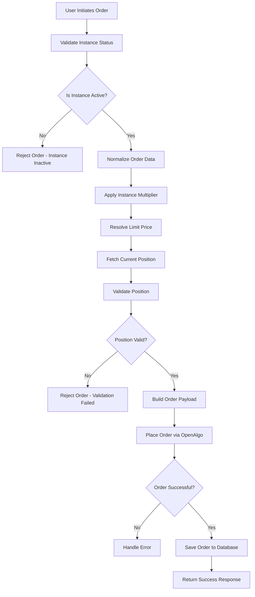
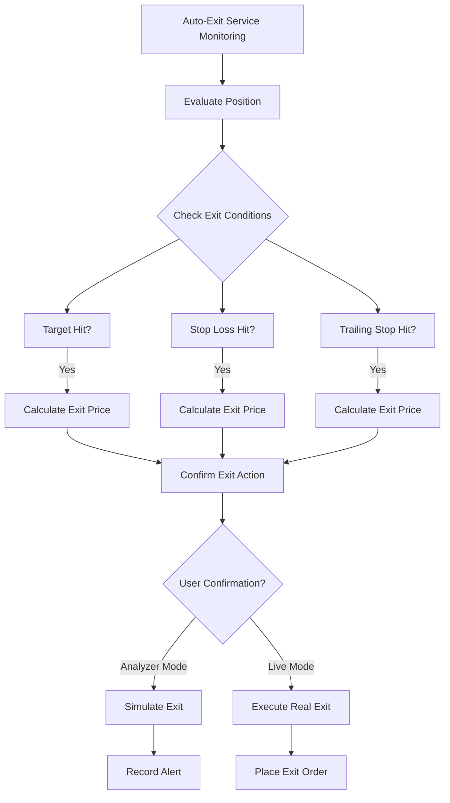
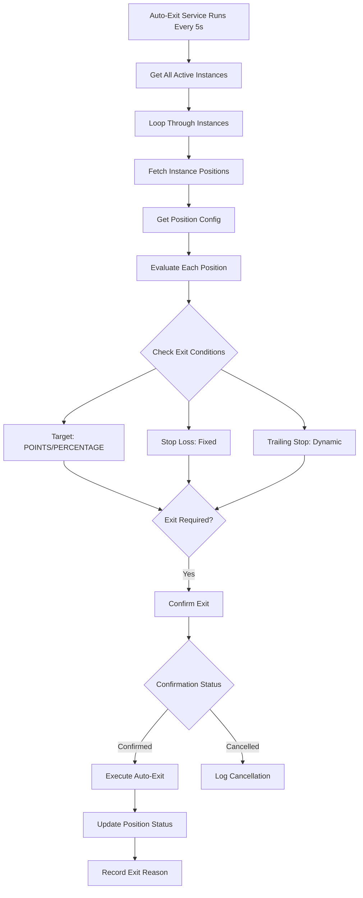
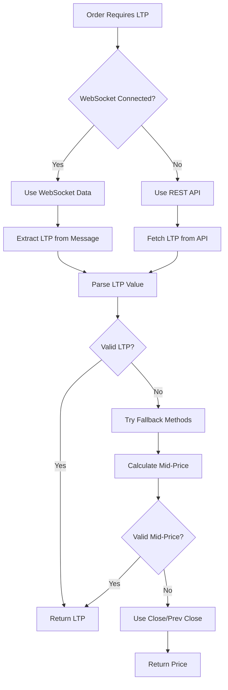
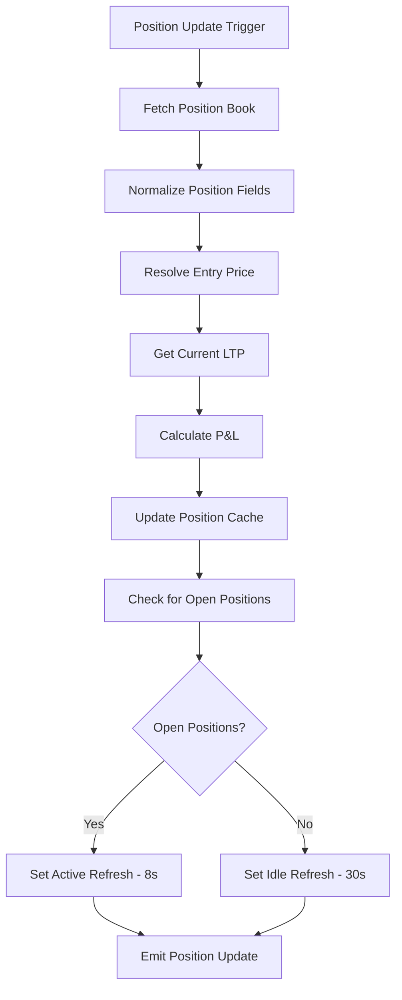
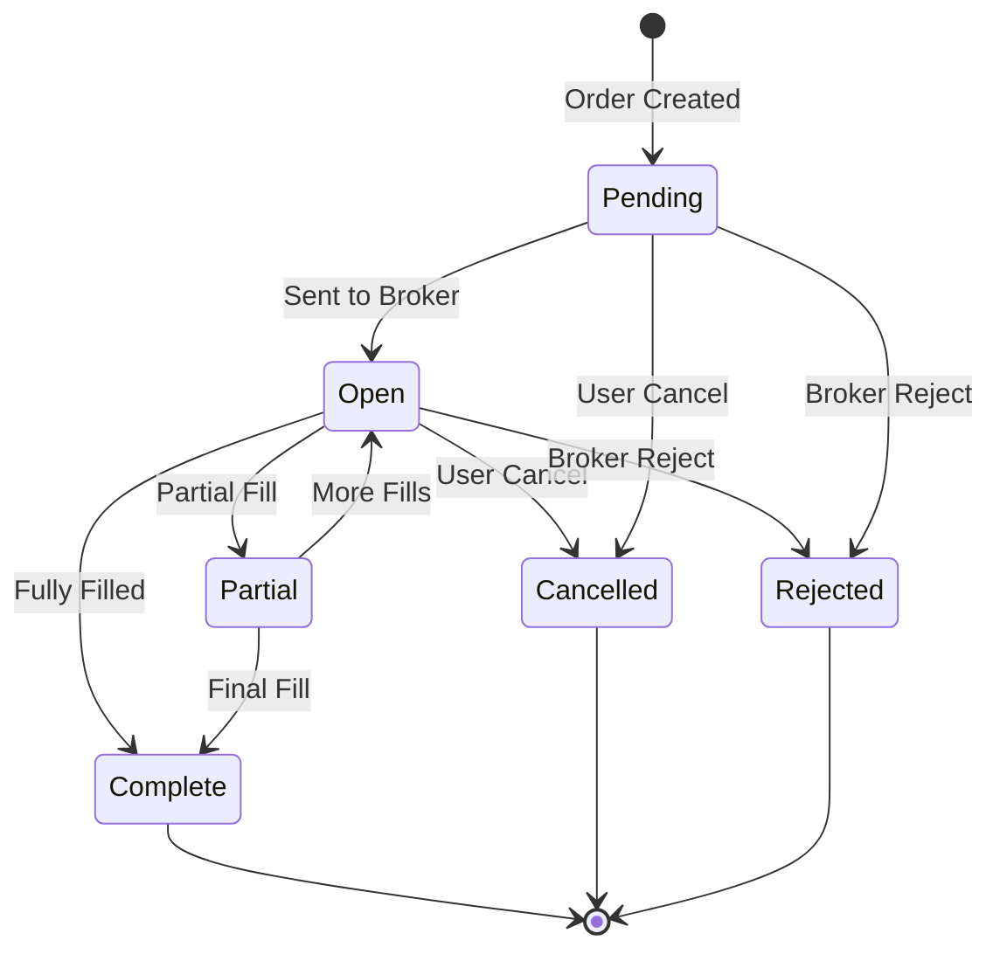
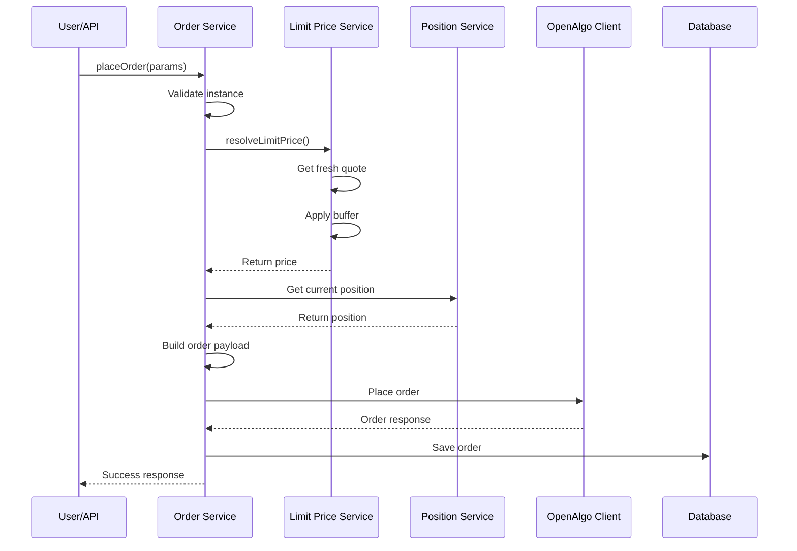
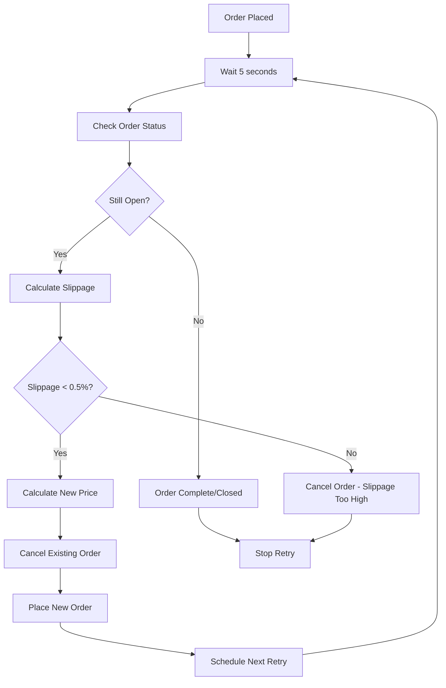
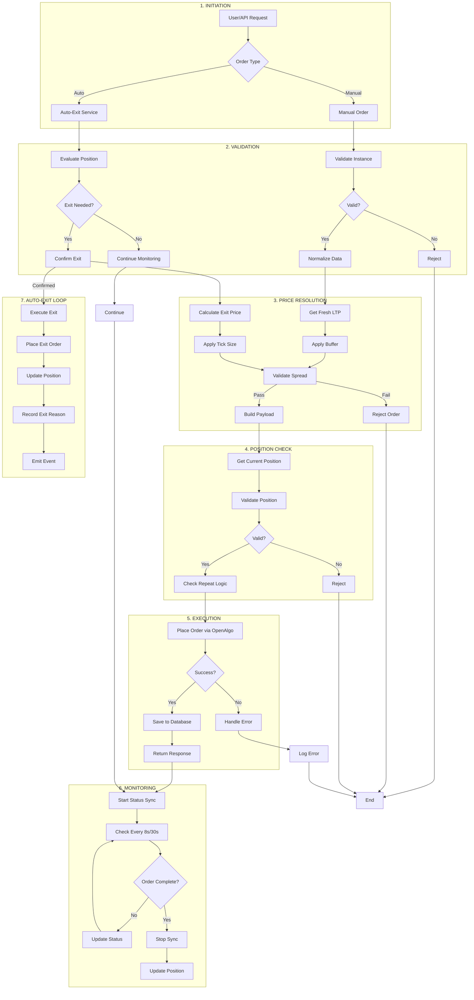
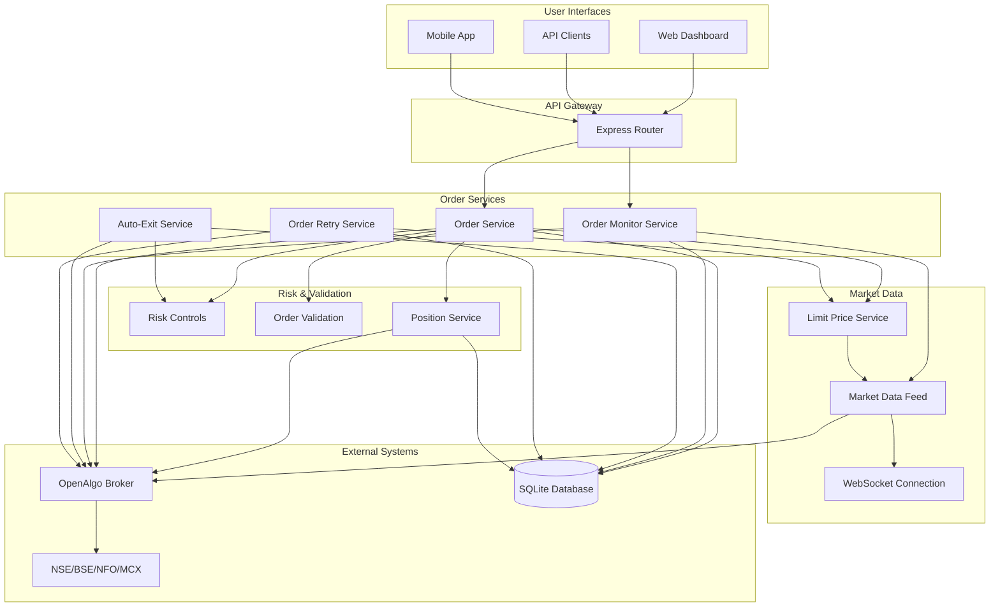

# Trading Application Order Workflow Analysis

## Table of Contents
1. [Order Types Overview](#order-types-overview)
2. [Entry Order Workflows](#entry-order-workflows)
3. [Exit Order Workflows](#exit-order-workflows)
4. [LTP (Last Traded Price) System](#ltp-last-traded-price-system)
5. [Position Book System](#position-book-system)
6. [Checks & Balances](#checks--balances)
7. [Order Execution Flow](#order-execution-flow)
8. [Complete Workflow Diagram](#complete-workflow-diagram)

---

## Order Types Overview

### Entry Order Types

| Order Type | Code | Description | Price Required | Trigger Price Required |
|------------|------|-------------|----------------|------------------------|
| **Market** | MARKET | Executed at current market price | No (converted to LIMIT) | No |
| **Limit** | LIMIT | Executed at specified price or better | Yes | No |
| **Stop Loss** | SL | Triggered when stop price is hit | Yes | Yes |
| **Stop Loss Market** | SL-M | Stop loss with market execution | No | Yes |

### Supported Exchanges & Products

| Category | Values |
|----------|--------|
| **Exchanges** | NSE, BSE, NFO, BFO, MCX, CDS |
| **Product Types** | MIS (Intraday), CNC (Delivery), NRML (Overnight) |
| **Actions** | BUY, SELL |

### Exit Order Types

| Exit Type | Trigger | Execution | Mode |
|-----------|---------|-----------|------|
| **Manual Exit** | User Action | Immediate | EXIT, EXIT_ALL |
| **Target Exit** | Profit Target | Automatic | POINTS, PERCENTAGE |
| **Stop Loss** | Loss Threshold | Automatic | Fixed, Trailing |
| **Trailing Stop** | Dynamic Threshold | Automatic | Follows price |

---

## Entry Order Workflows

### Manual Order Placement Flow



### Automatic Order Trigger Flow



### Order Types Detailed Comparison

| Aspect | MARKET | LIMIT | SL | SL-M |
|--------|--------|-------|----|-----|
| **Price Buffer** | Auto-calculated | Manual/Buffer | Trigger + Buffer | Trigger-based |
| **Slippage Control** | 0.5% max | Yes | Yes | N/A |
| **Spread Validation** | Yes (0.5% max) | Yes | Yes | Yes |
| **Retry Mechanism** | Yes (5s intervals) | Yes | Yes | Yes |
| **Order Modifications** | Converted to LIMIT | Direct | Via Trigger | Via Trigger |

---

## Exit Order Workflows

### Auto-Exit Service Flow



### Exit Reasons & Actions

| Exit Reason | Code | Description | Action Taken |
|-------------|------|-------------|--------------|
| **Target Met** | TARGET_MET | Profit target achieved | Close position |
| **Stop Loss Hit** | STOPLOSS_HIT | Loss threshold breached | Close position |
| **Trailing Stop** | TSL_HIT | Trailing stop triggered | Close position |
| **Manual Exit** | MANUAL | User-initiated | Close position |
| **Batch Exit** | BATCH_ALL | Exit all positions | Close all |

### Position Exit Decision Matrix

| Condition | LONG Position | SHORT Position | Action |
|-----------|---------------|----------------|--------|
| **Target Hit (Points)** | LTP ≥ Entry + Target | LTP ≤ Entry - Target | Exit |
| **Target Hit (%)** | LTP ≥ Entry × (1 + Target%) | LTP ≤ Entry × (1 - Target%) | Exit |
| **Stop Loss Hit** | LTP ≤ Entry - SL | LTP ≥ Entry + SL | Exit |
| **Trailing Stop** | LTP ≤ Peak - Trail | LTP ≥ Low + Trail | Exit |

---

## LTP (Last Traded Price) System

### LTP Fetching Hierarchy



### LTP Extraction Priority

| Priority | Field Names | Fallback Method |
|----------|-------------|-----------------|
| **1 (Primary)** | ltp, LTP, last_price, lastPrice, last_traded_price, lastTradedPrice | Direct LTP value |
| **2 (Bid/Ask)** | bid, ask | (Bid + Ask) / 2 |
| **3 (OHLC)** | close, prev_close, open, high, low | Close price preferred |
| **4 (Derived)** | average_price | Calculated average |

### Market Data Refresh Intervals

| Data Type | Active Positions | Idle State | TTL |
|-----------|------------------|-----------|-----|
| **Quotes (LTP)** | 5 seconds | 5 seconds | 5s |
| **Positions** | 8 seconds | 30 seconds | 8s/30s |
| **Funds** | 3 minutes | 3 minutes | 3 min |
| **Order Book** | 30 seconds | 30 seconds | 30s |
| **Trade Book** | 8 seconds | 30 seconds | 8s/30s |

### LTP Validation Rules

| Validation | Rule | Threshold | Action |
|------------|------|-----------|--------|
| **Freshness** | Age < Stale Threshold | 2-3 seconds | Use or Reject |
| **Spread** | (Ask - Bid) / Mid < Max | 0.5% | Validate or Error |
| **Circuit Breaker** | Failures > Threshold | 3 failures | Enter Cooldown |
| **Cooldown Period** | After Circuit Breaker | 30 seconds | Skip Polling |

---

## Position Book System

### Position Data Structure

```json
{
  "symbol": "RELIANCE",
  "exchange": "NSE",
  "quantity": 100,
  "entry_price": 2500.50,
  "entry_price_source": "tradebook_avg",
  "ltp_resolved": 2525.75,
  "pnl_derived": 2525.75,
  "position_side": "LONG",
  "unrealized_pnl": 2525.75
}
```

### Entry Price Resolution Hierarchy

| Tier | Source | Method | Reliability |
|------|--------|--------|-------------|
| **1** | Tradebook Average | Calculate avg fill price | High |
| **2** | Order Price | From database order | Medium |
| **3** | Fallback Cache | Cached at order time | Medium |
| **4** | Cross-Instance Median | Median of other instances | Low |

### Position Tracking Flow



### Position Validation Checks

| Check Type | Validation | Error Handling |
|------------|------------|----------------|
| **Quantity** | Parse from multiple fields | Log warning, use 0 |
| **Entry Price** | Multi-tier resolution | Cross-instance median |
| **Position Side** | Sign of quantity | LONG (>0), SHORT (<0) |
| **P&L Calculation** | (LTP - Entry) × Qty | Null if data missing |

---

## Checks & Balances

### Pre-Order Validation Checklist

| Validation | Rule | Error Message |
|------------|------|---------------|
| **Instance Status** | Must be active | "Instance is not active" |
| **Order Placement** | Must be enabled | "Order placement disabled" |
| **Symbol** | Must be valid | "Invalid symbol" |
| **Exchange** | Must be supported | "Invalid exchange" |
| **Action** | Must be BUY/SELL | "Invalid action" |
| **Quantity** | > 0, < 100000 | "Invalid quantity" |
| **Price** | > 0 for LIMIT/SL | "Price required" |
| **Product Type** | MIS/CNC/NRML | "Invalid product" |

### Risk Management Controls

| Control | Threshold | Purpose | Action |
|---------|-----------|---------|--------|
| **Slippage** | 0.5% max | Prevent bad fills | Cancel order |
| **Spread** | 0.5% max | Price sanity check | Reject order |
| **Quantity** | 100,000 max | Prevent errors | Warn user |
| **Stale Quote** | 2-3 seconds | Fresh data check | Use cache/fallback |

### Position-Based Validations

| Scenario | Validation | Result |
|----------|------------|--------|
| **SELL > LONG Position** | qty ≤ position | Allow partial/exact |
| **SELL > Position** | qty > position | Reject with error |
| **SELL with SHORT** | qty increases short | Warn, allow |
| **BUY with Position** | qty adds to position | Allow |

### Error Handling Strategy

| Error Type | Handling | Retry/Fallback |
|------------|----------|----------------|
| **Network Error** | Log and retry | Exponential backoff |
| **Market Closed** | Reject order | N/A |
| **Insufficient Funds** | Reject order | N/A |
| **Invalid Symbol** | Reject order | N/A |
| **Order Rejected** | Update status | User notification |
| **Partial Fill** | Track remaining | Retry with adjusted qty |

---

## Order Execution Flow

### Complete Order Lifecycle



### Order Placement Sequence



### Smart Order Features

| Feature | Description | Implementation |
|---------|-------------|----------------|
| **Position-Aware** | Repeat until target | Compare current vs target |
| **Auto Retry** | Retry failed orders | 5-second intervals |
| **Buffer Management** | Price protection | Configurable buffer points |
| **Tick Size** | Price rounding | Exchange-specific |
| **Slippage Control** | Prevent bad fills | 0.5% max slippage |
| **Correlation ID** | Track orders | UUID-based |

### Order Retry Mechanism



### Status Mapping

| Broker Status | Internal Status | Display |
|---------------|-----------------|---------|
| open | open | Open |
| pending | pending | Pending |
| complete | complete | Complete |
| cancelled | cancelled | Cancelled |
| rejected | rejected | Rejected |
| trigger pending | pending | Pending |
| partially filled | open | Open |

---

## Complete Workflow Diagram

### End-to-End Order Flow



### System Architecture Overview



---

## Key Metrics & Performance

### Order Processing Metrics

| Metric | Value | Purpose |
|--------|-------|---------|
| **Order Latency** | < 100ms | Speed of order placement |
| **LTP Refresh** | 5 seconds | Data freshness |
| **Position Sync** | 8s/30s | Position accuracy |
| **Auto-Exit Check** | 5 seconds | Exit responsiveness |
| **Retry Interval** | 5 seconds | Order retry timing |
| **Max Slippage** | 0.5% | Slippage protection |

### Capacity Limits

| Resource | Limit | Reason |
|----------|-------|--------|
| **Max Quantity** | 100,000 | Prevent errors |
| **Max Spread** | 0.5% | Price sanity |
| **Max Slippage** | 0.5% | Fill quality |
| **Retry Count** | Unlimited (with interval) | Ensure execution |
| **Order Age** | No limit | Hold as needed |

---

## Configuration Points

### Instance Multiplier
- Range: 1-999
- Multiplies both quantity and position_size
- Applied after validation

### Buffer Points
- Configurable per exchange/symbol
- Applied to limit price
- Protects against adverse fills

### Refresh Intervals
- Active: 8 seconds (positions)
- Idle: 30 seconds (positions)
- Always: 5 seconds (quotes, auto-exit)

---

## Error Codes & Messages

| Code | Message | Cause | Resolution |
|------|---------|-------|------------|
| 400 | Instance is not active | Instance disabled | Activate instance |
| 400 | Invalid symbol | Symbol not recognized | Use valid symbol |
| 400 | Price is required | Missing price for LIMIT | Provide price |
| 400 | Quantity must be > 0 | Invalid quantity | Use positive quantity |
| 400 | Cannot SELL X - current position is Y | Insufficient position | Reduce quantity |
| 400 | Bid/ask spread too wide | Market condition | Wait for better spread |
| 400 | Quote is stale | Old data | Retry with fresh quote |
| 500 | Order retry failed | Network/broker error | Check logs, retry |

---

## Conclusion

This trading application implements a **production-grade order management system** with:

✅ **Multi-tiered order validation** - Prevents invalid orders
✅ **Real-time market data** - WebSocket + REST fallback
✅ **Position-aware execution** - Smart order continuation
✅ **Comprehensive risk controls** - Slippage, spread, validation
✅ **Automated exit triggers** - Target, stop-loss, trailing
✅ **Retry mechanisms** - Ensures order execution
✅ **Circuit breakers** - Resilient error handling
✅ **Dynamic refresh** - Optimized resource usage

The system demonstrates **enterprise-level architecture** with proper separation of concerns, comprehensive error handling, and multiple layers of validation to ensure reliable and safe order execution.
