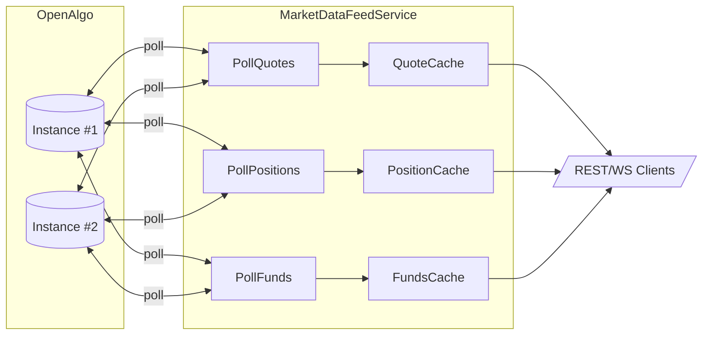

# Market Data Feed Service (Step 2)

To keep OpenAlgo traffic predictable when multiple admins use the dashboard, the backend now exposes a centralized feed service that polls the broker APIs once and caches the results for everyone.

## Overview

File: `backend/src/services/market-data-feed.service.js`

Responsibilities:

1. Poll OpenAlgo for commonly used feeds (quotes/LTP, position books, funds balances) at configurable intervals.
2. Cache the latest payload per instance and timestamp the fetch time (exposed via `get*Snapshot` / `set*Snapshot` helpers).
3. Emit events (`quotes:update`, `positions:update`, `funds:update`) that other services (future WebSocket push, REST inval) can listen to.
4. Provide getters so routes/services can serve cached snapshots instead of calling OpenAlgo directly.
5. Provide invalidation helpers (`invalidatePositions`, `invalidateFunds`) so order flows can trigger a targeted refresh after trades.
6. Run once per server (started in `server.js`) so all admins share the same rate budget.

## Default Cadence

| Feed | Interval (ms) | Notes |
| --- | --- | --- |
| Quotes | 2000 (overridable via `config.polling.marketDataInterval`) | Polls market data instances returned by `marketDataInstanceService`. |
| Positions | 10000 | Polls all active trading instances (used by `/positions`, quick orders, PnL). |
| Funds | 15000 | Polls all active trading instances (used by dashboard + PnL). |

## Next Steps

1. Update REST endpoints (watchlists, positions, dashboard cards, etc.) to read from the feed service caches.
2. Build symbol watchlist integration for `_buildGlobalSymbolList()` so quote polls only include tracked instruments.
3. Add rate-limit accounting and backoff logic.
4. Broadcast cache updates over WebSockets so the UI can drop most polling.
