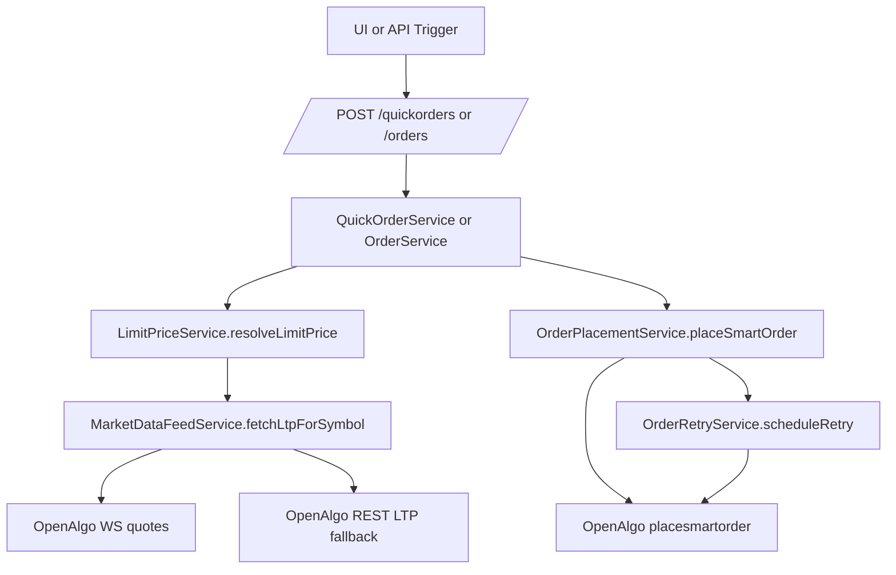
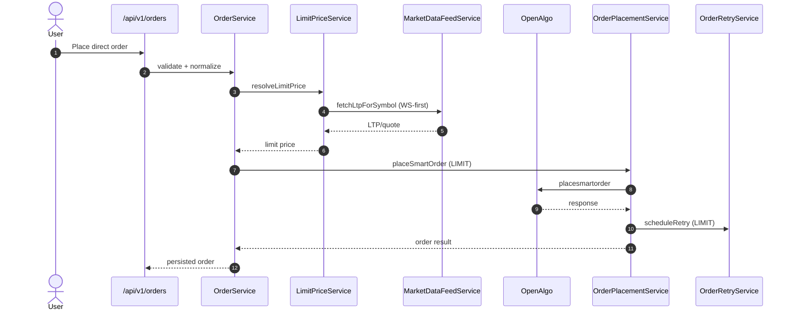
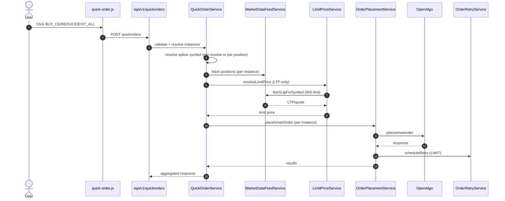

# Order Entry and Exit Workflows

This document summarizes how entry and exit orders flow through the system, including LTP sourcing, position checks, pricing guards, and retry behavior. It is written for the current backend implementation and references the primary services that enforce checks and balances.

## Order Types (Entry vs Exit)

| Action | Entry/Exit | Trade Mode | Primary Strategy | Trigger Surface | Key Services |
| --- | --- | --- | --- | --- | --- |
| BUY / SELL / SHORT / COVER | Entry | EQUITY / FUTURES | DIRECT_ORDER | Watchlist quick order, API | `backend/src/services/quick-order.service.js`, `backend/src/services/order.service.js` |
| BUY_CE / BUY_PE / SELL_CE / SELL_PE | Entry | OPTIONS | OPTIONS_WITH_RECONCILIATION | Watchlist quick order | `backend/src/services/quick-order.service.js` |
| INCREASE_CE / INCREASE_PE | Entry (scale) | OPTIONS | OPTIONS_WITH_RECONCILIATION | Watchlist quick order | `backend/src/services/quick-order.service.js` |
| REDUCE_CE / REDUCE_PE | Exit (scale) | OPTIONS | OPTIONS_WITH_RECONCILIATION | Watchlist quick order | `backend/src/services/quick-order.service.js` |
| EXIT | Exit (single symbol) | EQUITY / FUTURES / OPTIONS | CLOSE_POSITIONS | Watchlist quick order, API | `backend/src/services/quick-order.service.js`, `backend/src/services/order.service.js` |
| EXIT_ALL | Exit (all strikes for symbol) | OPTIONS | CLOSE_POSITIONS | Watchlist quick order | `backend/src/services/quick-order.service.js` |
| CLOSE_ALL_CE / CLOSE_ALL_PE | Exit (option type) | OPTIONS | CLOSE_POSITIONS | Watchlist quick order | `backend/src/services/quick-order.service.js` |

Notes:
- Manual/direct orders (non-quick-order) go through `OrderService.placeOrder()` and are treated as DIRECT orders with the same limit pricing and retry controls.
- Options actions that adjust size (INCREASE/REDUCE) are handled per open position when using FLOAT_OFS, to prevent mismatched strikes.

## High-Level Flow (Entry and Exit)



## LTP and Quote Sourcing (Order-Critical)

Order pricing uses LTP and is always LIMIT. The LTP path is WS-first, with retries, and falls back to REST only after WS is exhausted.

| Step | Source | Behavior | File |
| --- | --- | --- | --- |
| 1 | WS Live Quote | Try up to 5 connected instances, round-robin per symbol, preferring recent quotes; subscribe symbol if needed; retry each instance (`wsRetries`, default 5) | `backend/src/services/market-data-feed.service.js` |
| 2 | WS Cache | If no fresh live quote, use recent WS-cached quote (order-critical TTL) | `backend/src/services/market-data-feed.service.js` |
| 3 | Quote Cache | Use cached quote (order-critical TTL) if available | `backend/src/services/market-data-feed.service.js` |
| 4 | REST LTP | Use `openalgoClient.getLtpWithRetry` across market-data instances, with exponential backoff and instance rotation | `backend/src/services/market-data-feed.service.js` |

Additional guards:
- Quote blackout window is enforced (`instance-health.service.js`), so LTP fetch throws during blackout hours.
- Non-critical polling is paused briefly during order-critical LTP fetches to reduce contention.

## Limit Price Rules (Entry and Exit)

Pricing is resolved in `backend/src/services/limit-price.service.js`.

1. Always LIMIT (market orders are blocked).
2. Base price is LTP when available; bid/ask is only used if LTP is missing.
3. If bid/ask is used and deviates from LTP by more than buffer, the price is clamped back to LTP.
4. Buffer is applied to base price (BUY adds, SELL subtracts).
5. Price is rounded to tick size if configured.
6. Quotes older than `market_data_feed.order_quote_stale_ms` are rejected.
7. Optional spread check blocks wide bid/ask spreads (configurable).

## Entry Workflow (Manual/Direct Order)

Primary path: `backend/src/services/order.service.js`

1. Validate instance exists and is active.
2. Normalize payload and apply instance multiplier.
3. Resolve buffer and tick size from `watchlist_symbols`.
4. Fetch LTP and compute LIMIT price (see LTP + pricing rules).
5. Fetch live position book for the instance to determine current position.
6. Decide retry policy: if order reduces or closes a position, enable repeat-until-target.
7. Build `placesmartorder` payload and dispatch via `OrderPlacementService`.
8. Persist order to `watchlist_orders` and emit notifications (non-blocking).
9. Order placement schedules retry checks for LIMIT orders.

## Entry Workflow (Quick Order, Equity/Futures)

Primary path: `backend/src/services/quick-order.service.js`

1. Validate request parameters and symbol configuration.
2. Resolve instance list (all active, order-placement-enabled instances for the watchlist).
3. Resolve strategy: DIRECT_ORDER for BUY/SELL/SHORT/COVER.
4. Fetch positions per instance (parallel when multi-instance) to compute target sizes.
5. Resolve LIMIT price (same LTP logic).
6. Place orders per instance via `OrderPlacementService`.
7. Aggregate responses and return per-instance results.

## Entry Workflow (Quick Order, Options)

Primary path: `backend/src/services/quick-order.service.js`

1. Resolve option symbol (pre-resolve once for most actions; per-instance for FLOAT_OFS reduce/increase).
2. Fetch positions per instance to understand current holdings.
3. Decide target position per action:
   - BUY/SELL CE/PE create or add positions.
   - INCREASE/REDUCE adjusts size (per position for FLOAT_OFS).
4. Resolve LIMIT price using LTP-only base logic.
5. Place per-instance orders via `OrderPlacementService`.

## Exit Workflow (Direct Exit / Close)

Primary path: `backend/src/services/quick-order.service.js` (`_closePositions`)

1. Determine close mode: EXIT, EXIT_ALL, CLOSE_ALL_CE, CLOSE_ALL_PE.
2. Fetch live positions (or cached if allowed by caller) for the instance.
3. Filter positions by symbol, expiry, option type, and trade mode.
4. For each open position, compute close action (SELL if long, BUY if short).
5. Resolve LIMIT price (LTP-based).
6. Place close orders per position via `OrderPlacementService`.
7. Cancel hanging open/pending orders for the symbol after exit attempts.

## Retry Logic (Entry and Exit)

Primary path: `backend/src/services/order-retry.service.js`

1. Only LIMIT orders get retries.
2. After 5 seconds, check orderbook status.
3. If order is filled, no retry.
4. If order is open/partial:
   - Cancel only open/pending orders for the same symbol/exchange/product.
   - Reprice using current LTP and buffer; re-place with updated price.
   - If partial fill: retry only the remaining quantity.
5. If LTP is missing or initial price is invalid, cancel open orders for that symbol and stop.
6. If slippage vs initial price exceeds 0.5%, cancel open orders and stop unless repeating until closed.
7. Final check after another 5 seconds:
   - If repeat-until-closed is enabled, retry until target position is reached.
   - Otherwise, cancel any remaining open orders for the symbol.

Important safety controls:
- Retries never cancel open positions; only open/pending orders for the same symbol are canceled.
- Exit and reduce actions enable repeat-until-closed so the final position reaches the intended target.

## Order Placement Scheduling (placesmartorder)

To align with `placesmartorder` semantics and OpenAlgo rate limits, placements are serialized per instance, coalesced per symbol, and rate-limited.

| Behavior | Description |
| --- | --- |
| Per-instance serialization | Only one order placement is in-flight per instance at a time. |
| Latest-wins coalescing | Multiple queued requests for the same symbol/product collapse into the most recent payload; earlier callers receive the latest response. |
| 2 rps token bucket | Enforces ~2 placements/second per instance before calling OpenAlgo. |

## Optional Cancel Rule (Before Placement)

Cancelling open/pending orders before placement is now opt-in via `context.cancelOpenOrdersBeforePlacement`. It is off by default to avoid interfering with `placesmartorder` target semantics.

## Position and Entry Price Sourcing (For Display and Reconciliation)

Primary path: `backend/src/services/positions.service.js`

Entry price used in the UI is resolved in this order:
1. Tradebook weighted average (if available).
2. Last limit price from `watchlist_orders`.
3. Fallback entry price captured at placement time.
4. Cross-instance median LTP as a last resort.

This is for display and reconciliation only; order placement always uses LTP-based LIMIT pricing.

## Key Files and Services

| Area | File |
| --- | --- |
| Manual/direct order placement | `backend/src/services/order.service.js` |
| Quick order orchestration | `backend/src/services/quick-order.service.js` |
| Order placement + validation | `backend/src/services/order-placement.service.js` |
| Retry and cancel logic | `backend/src/services/order-retry.service.js` |
| Limit price computation | `backend/src/services/limit-price.service.js` |
| LTP/quote fetching | `backend/src/services/market-data-feed.service.js` |
| WS quote connection | `backend/src/services/openalgo-ws.service.js` |

## Service Roles: Quick Orders vs Direct Orders

| Aspect | QuickOrderService | OrderService |
| --- | --- | --- |
| Entry Point | `/api/v1/quickorders` | `/api/v1/orders` |
| Primary Use | Watchlist quick buttons, multi-instance fan-out | Manual/direct single-order |
| Trade Modes | EQUITY, FUTURES, OPTIONS | Direct order only (no options orchestration) |
| Strategy Layer | DIRECT_ORDER, OPTIONS_WITH_RECONCILIATION, CLOSE_POSITIONS | None |
| Option Symbol Resolution | Yes | No |
| Position Pre-Fetch | Yes (parallel for multi-instance) | Per-instance live position check |
| Output | Aggregated results per instance | Single order record (persisted) |

## Per-Action Flows (Options)

Each row summarizes the exact flow shape for the given action. These are quick-order actions.

| Action | Entry/Exit | Position Scope | Option Symbol Resolution | Position Targeting | Retries | Cancels |
| --- | --- | --- | --- | --- | --- | --- |
| BUY_CE / BUY_PE | Entry | Single strike | Pre-resolve once (shared across instances) | Increase long quantity | LIMIT retry once + final check | Cancels only open/pending orders for symbol on retry |
| SELL_CE / SELL_PE | Entry | Single strike | Pre-resolve once (shared across instances) | Increase short quantity | LIMIT retry once + final check | Cancels only open/pending orders for symbol on retry |
| INCREASE_CE / INCREASE_PE | Entry (scale) | Per open position (FLOAT_OFS) | Per-instance; per open position if FLOAT_OFS | Increase absolute position size | Repeat-until-target when reducing slippage risk | Cancels only open/pending orders for symbol on retry |
| REDUCE_CE / REDUCE_PE | Exit (scale) | Per open position (FLOAT_OFS) | Per-instance; per open position if FLOAT_OFS | Reduce absolute position size | Repeat-until-target until reduced qty reached | Cancels only open/pending orders for symbol on retry |
| CLOSE_ALL_CE / CLOSE_ALL_PE | Exit | All CE/PE strikes for symbol | Uses option type filter + expiry | Target = 0 for each position | Repeat-until-target until flat | Cancels only open/pending orders for symbol |
| EXIT_ALL | Exit | All option positions for symbol | Uses expiry; ignores option type | Target = 0 for each position | Repeat-until-target until flat | Cancels only open/pending orders for symbol |

Notes:
- FLOAT_OFS reduce/increase actions target each open strike to avoid mismatched reconciliation.
- Retry behavior applies to LIMIT orders only and is driven by `OrderRetryService`.

## Per-Action Flows (Equity/Futures/Direct)

| Action | Entry/Exit | Position Scope | Target Position | Retries | Cancels |
| --- | --- | --- | --- | --- | --- |
| BUY | Entry | Symbol+product | Position increases by qty | LIMIT retry once + final check | Cancels only open/pending orders for symbol |
| SELL | Entry (or close if long) | Symbol+product | Position decreases by qty | LIMIT retry once + final check | Cancels only open/pending orders for symbol |
| SHORT | Entry | Symbol+product | Position decreases by qty (short) | LIMIT retry once + final check | Cancels only open/pending orders for symbol |
| COVER | Exit (short reduce) | Symbol+product | Position increases toward 0 | Repeat-until-target when reducing | Cancels only open/pending orders for symbol |
| EXIT | Exit (flatten) | Symbol+product | Target = 0 | Repeat-until-target until flat | Cancels only open/pending orders for symbol |

## Sequence Diagrams

### Manual Order (Direct)



### Quick Order (Options)



## Environment-Specific Tailoring (Production vs Local)

These knobs directly affect order flow timing, pricing, and retries. If you want a tailored version for a specific broker or instance, share the values and I will populate them here.

| Category | Config/Setting | Effect |
| --- | --- | --- |
| WS Quotes | `instances.use_ws_quotes`, `instances.websocket_url` | Enables WS-first LTP; if off, REST fallback used sooner. |
| LTP TTL | `market_data_feed.order_quote_stale_ms` | Rejects stale quotes for limit price. |
| Spread Guard | `market_data_feed.max_order_spread_pct` | Blocks limit price when bid/ask is too wide. |
| LTP Retry | `MarketDataFeedService.fetchLtpForSymbol` options | WS instance rotation + retry cadence before REST fallback. |
| Position Refresh | `market_data_feed.positionInterval*Ms` | Impacts pre-fetch and exit accuracy. |
| Tradebook Refresh | `market_data_feed.tradebookInterval*Ms` | Affects display entry price sourcing. |
| Rate Limiting | OpenAlgo client | Order placement uses `skipRateLimit: true` for critical flows. |
| Retry Timing | `OrderRetryService` | Retry after 5s, final check after 5s. |

### Tailoring Template (Fill In)

```text
Broker: ______________________
Instance IDs: _________________
use_ws_quotes: true/false
websocket_url: ______________________
order_quote_stale_ms: __________
max_order_spread_pct: __________
positionIntervalIdleMs: ________
positionIntervalActiveMs: ______
tradebookIntervalIdleMs: _______
tradebookIntervalActiveMs: _____
```
